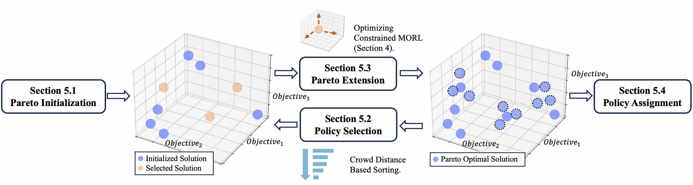

# Efficient Discovery of Pareto Front for Multi-Objective Reinforcement Learning

Ruohong Liu*, Yuxin Pan*, Linjie Xu, Lei Song, Jiang Bian, Pengcheng You, Yize Chen  
The Twelfth International Conference on Learning Representations (ICLR 2025)  

In this [paper](https://openreview.net/forum?id=fDGPIuCdGi), we propose a two-stage Pareto front discovery algorithm called Constrained
MORL (C-MORL), which serves as a seamless bridge between constrained policy optimization and MORL. Concretely, a set of policies aretrained in parallel in the initialization stage, with each optimized towards its individual preference over the multiple objectives. Then, to fill the remaining vacancies in the Pareto front, the constrained optimization steps are employed to maximize one objective while constraining the other objectives to exceed a predefined threshold.



# Installation

- **Operating System**: tested on Ubuntu 20.04.6
- **Python Version**: tested on 3.8.10
- **PyTorch Version**: tested on 2.0.0
- **MuJoCo**: Install MuJoCo and `mujoco-py` version 2.1 by following instructions in [mujoco-py](https://github.com/openai/mujoco-py)
- **mo-gymnasium**: == 1.1.0

# Benchmarks
We validate the effectiveness of our proposed algorithm across a variety of well-known discrete and continuous MORL benchmarks, including MO-Hopper-2d, MO-Hopper-3d, MO-Ant-2d, MO-Ant-3d, MO-Humanoid-2d, Minecart, MO-Lunar-Lander, and Fruit-Tree. We use the implementation of [MO-Gymnasium](https://mo-gymnasium.farama.org/index.html).

To further demonstrate our algorithm's capability on more realistic and complex tasks, we introduce two customized multi-objective benchmarks, Building-3d and Building-9d, adapted from the building energy control scenarios provided by [SustainGym](https://chrisyeh96.github.io/sustaingym/). These environments simulate large commercial buildings with multiple zones, requiring the balancing of temperature regulation, energy cost minimization, and the management of power consumption ramping rates. This makes them particularly suitable for testing and developing multi-objective reinforcement learning algorithms in practical settings.

To customize your own environment, simply add your environment file to the `environments/` directory.

**Note:** Our implementation is based on the original gym interface. If your environment is implemented using gymnasium, please make sure it is compatible or appropriately adapted to match the Gym API.

# Basic Usage
To run our algorithm on Building-3d for a single run:
```bash
python scripts/building_3d.py --cmorl-ipo --num-seeds 1
```

# Reference
We refer to the implementation from [PGMORL](https://github.com/mit-gfx/PGMORL.git) as a base for part of our code.

If you find our paper or code is useful, please consider citing:
@inproceedings{liuefficient,
  title={Efficient Discovery of Pareto Front for Multi-Objective Reinforcement Learning},
  author={Liu, Ruohong and Pan, Yuxin and Xu, Linjie and Song, Lei and You, Pengcheng and Chen, Yize and Bian, Jiang},
  booktitle={The Thirteenth International Conference on Learning Representations}
}


